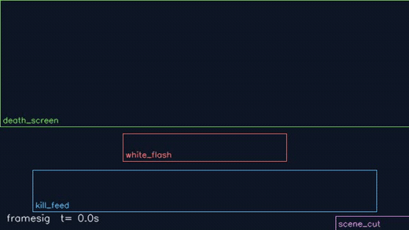
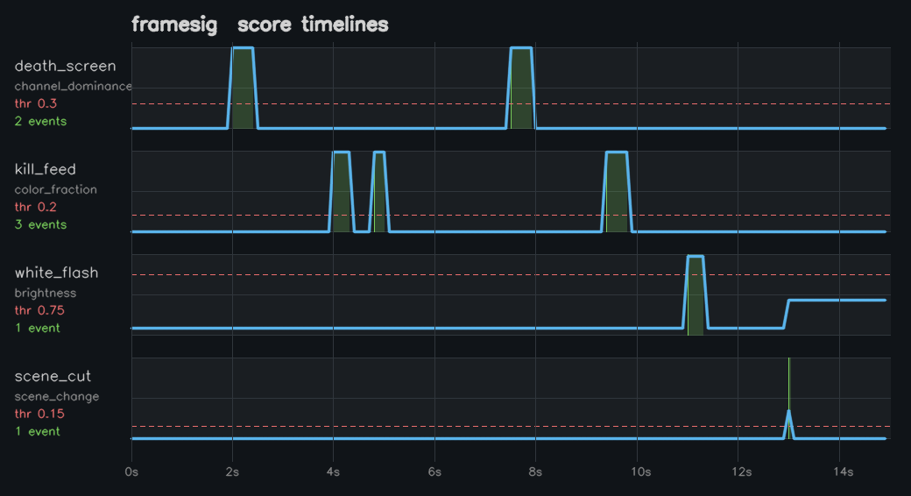

# framesig

**Find *when* something happens on screen — in any video, from any game or source — by its pixel signature.**

  

framesig doesn't know what a "kill" or a "death screen" looks like — and it doesn't need to. You describe an event as **a region of the frame + a colour/brightness signature** in a few lines of YAML, and framesig scans the video and hands you back the **timestamps** where that signature appears. Red flash in the HUD, a coloured kill-feed row, a fade to black, a hard cut — same tiny config, no model, no training, no per-game code.

<p align="center">
  
</p>

<sub>Above: framesig watching four independent regions of a synthetic clip. Boxes light up the instant their signature fires; the number is the live score.</sub>

---

## Why it's useful

- **Source-agnostic.** It only ever reasons about pixels in a rectangle, never about the game. The same tool works on League, CS, a slideshow, or security footage.
- **Declarative.** Events live in YAML, not code. Tweak a region or a threshold, re-run — no recompiling, no re-scanning (see caching below).
- **Cheap to re-tune.** Scanning a video is the expensive part; framesig caches the raw per-frame scores, so changing a threshold is *instant*.
- **Self-contained demo.** `framesig demo` renders its own test clip with ffmpeg, scans it, and charts the result — no external video or model to download.

## Features

- Four built-in detectors: `channel_dominance`, `color_fraction`, `brightness`, `scene_change`.
- Regions in resolution-independent fractions (or absolute pixels).
- Frame sub-sampling at a configurable rate for speed.
- JSON event output, with peak time, peak/mean score, duration and sample count per event.
- On-disk **score cache** keyed so that changing a threshold reuses the scan, while changing a detector invalidates it.
- A pure-OpenCV score-timeline chart renderer (no matplotlib dependency).
- Clean Python API and a `framesig` CLI.

## Install

framesig needs only `numpy`, `opencv-python-headless` and `PyYAML`. (`ffmpeg` on your `PATH` is optional — it's used only to *generate* the sample clip in `gen-sample` / `demo`; scanning real videos does not need it.)

```bash
git clone https://github.com/ferinazumaDEV/framesig
cd framesig
python -m venv .venv && . .venv/bin/activate
pip install -e ".[dev]"
```

## Quickstart

Render a synthetic test clip, scan it, and chart the detections in one command:

```console
$ framesig demo
[1/3] rendering synthetic clip with ffmpeg...
[2/3] scanning for pixel signatures...
sample.mp4  640x360  15.0s  150 samples @ 10.0 fps  (scan)
7 event(s) across 4 signature(s)
  death_screen: 2
    [  2.00s ->   2.40s]  peak 1.00 @   2.00s  (5 samples)
    [  7.50s ->   7.90s]  peak 1.00 @   7.50s  (5 samples)
  kill_feed: 3
    [  4.00s ->   4.30s]  peak 0.98 @   4.00s  (4 samples)
    [  4.80s ->   5.00s]  peak 0.98 @   4.80s  (3 samples)
    [  9.40s ->   9.80s]  peak 0.98 @   9.40s  (5 samples)
  white_flash: 1
    [ 11.00s ->  11.30s]  peak 0.98 @  11.00s  (4 samples)
  scene_cut: 1
    [ 13.00s ->  13.00s]  peak 0.35 @  13.00s  (1 samples)
[3/3] rendering score-timeline chart...
done. outputs in framesig_demo/
```

Every event lands exactly where the clip was painted — two death flashes, three kill-feed rows, one white flash, one scene cut. The chart it writes:

<p align="center">
  
</p>

Each lane is one signature: the blue curve is the raw score, the red dashed line is the threshold, the green bands are the detected events.

## Usage

### CLI

```console
$ framesig gen-sample sample.mp4
wrote sample.mp4  (640x360, 15s)

$ framesig scan sample.mp4 -c examples/flash.yaml -o events.json
sample.mp4  640x360  15.0s  150 samples @ 10.0 fps  (scan)
7 event(s) across 4 signature(s)
  death_screen: 2
    [  2.00s ->   2.40s]  peak 1.00 @   2.00s  (5 samples)
    ...
wrote events.json
```

Run it again and the scan is served from cache — note the `(cache)` tag:

```console
$ framesig scan sample.mp4 -c examples/flash.yaml -o events.json
sample.mp4  640x360  15.0s  150 samples @ 10.0 fps  (cache)
```

`events.json` (one signature shown):

```json
{
  "video": "sample.mp4",
  "meta": { "native_fps": 30.0, "frame_count": 450, "width": 640, "height": 360,
            "sample_fps": 10.0, "step": 3, "sample_period": 0.1,
            "samples": 150, "duration": 15.0 },
  "from_cache": false,
  "events": {
    "death_screen": [
      { "signature": "death_screen", "start": 2.0, "end": 2.4, "duration": 0.5,
        "peak_t": 2.0, "peak_score": 1.0, "mean_score": 1.0, "samples": 5 }
    ]
  }
}
```

Handy flags: `--sample-fps N` (override sampling rate), `--no-cache`, `--chart timeline.png`, `-q`.

### Config

A signature is a **detector** applied to a **region**, plus rules for turning the score timeline into discrete events:

```yaml
sample_fps: 10                       # analyse ~10 frames per second of video
cache_dir: .framesig_cache           # optional; default is a .framesig_cache
                                     # folder next to the video

regions:                             # bounds are fractions of the frame by default
  hud_top:    { x: 0.00, y: 0.00, w: 1.00, h: 0.55 }
  kill_feed:  { x: 0.08, y: 0.74, w: 0.84, h: 0.18 }
  minimap:    { x: 1500, y: 800, w: 400, h: 250, unit: pixels }   # absolute pixels

signatures:
  - name: death_screen
    region: hud_top
    detector: channel_dominance      # "relative red", robust to compression
    params: { channel: red, gain: 2.0 }
    threshold: 0.30                   # score >= 0.30 counts as active
    min_duration: 0.15               # drop blips shorter than 0.15 s
    merge_gap: 0.25                   # bridge flickers up to 0.25 s apart

  - name: kill_feed
    region: kill_feed
    detector: color_fraction         # % of red pixels in the band (two HSV ranges: red wraps hue)
    params:
      hsv_low:  [0, 120, 70]
      hsv_high: [10, 255, 255]
      hsv_low2: [170, 120, 70]
      hsv_high2: [179, 255, 255]
    threshold: 0.20
```

See [`examples/flash.yaml`](examples/flash.yaml) for the full four-signature config.

### Python API

```python
from framesig import load_config, scan_video, detect_all

config = load_config("examples/flash.yaml")
result = scan_video("sample.mp4", config)      # scores get cached on disk
events = detect_all(config, result)            # applying thresholds is free

for name, evs in events.items():
    for e in evs:
        print(f"{name}: {e.peak_t:.2f}s (score {e.peak_score:.2f})")
```

```
death_screen: 2.00s (score 1.00)
death_screen: 7.50s (score 1.00)
kill_feed: 4.00s (score 0.98)
...
```

## Detectors

| detector | measures | good for | key params |
|---|---|---|---|
| `channel_dominance` | how much one BGR channel beats the other two | red death/kill flashes; survives compression, ignores brightness | `channel`, `gain` |
| `color_fraction` | fraction of pixels inside one or more HSV ranges | coloured HUD elements (kill feed, objective banners) | `hsv_low/high`, `hsv_low2/high2` |
| `brightness` | mean luminance | white flashes (`invert: false`), fades to black (`invert: true`) | `invert` |
| `scene_change` | mean absolute difference from the previous sampled frame | hard cuts, big transitions | — |

`framesig detectors` lists them at runtime.

## How it works

```
video ──▶ sub-sample frames ──▶ crop each region ──▶ detector score in [0,1]
                                                          │
                                            per-frame score timelines
                                                          │
                                    ┌─────────────────────┴─── cached on disk ───┐
                                    ▼                                             │
                    threshold · merge_gap · min_duration                         │
                                    ▼                                             │
                                 events ◀── re-run with new thresholds, free ◀────┘
```

1. **Sample.** The scanner walks the video once and keeps roughly `sample_fps` frames per second.
2. **Score.** Each signature crops its region and asks its detector for one number in `[0, 1]`.
3. **Cache.** Those score timelines are written to `.framesig_cache/`, keyed by a fingerprint of the video **and** of the *score-relevant* config (sampling rate, regions, detector params) — but **not** thresholds. So re-tuning a threshold is a cache hit; changing a detector transparently invalidates it.
4. **Detect.** Thresholding turns each timeline into events: consecutive active samples become a run, nearby runs merge (`merge_gap`), too-short runs are dropped (`min_duration`).

## Testing

```console
$ pytest
88 passed
```

The suite includes an end-to-end test that renders the synthetic clip with ffmpeg and asserts framesig recovers exactly the events baked into it, at the right timestamps — plus unit tests for every detector, the event logic, config validation, the scanner's error paths and the cache.

## Sibling tools

framesig is one of a set of small, dependency-light tools I build and maintain in the open — focused utilities that each do one job well and turn messy input into clean, structured output. If framesig fits into your pipeline, these siblings share the same engineering-first philosophy:

- [The GEO Handbook](https://github.com/ferinazumaDEV/generative-engine-optimization-handbook) — the open reference on getting content cited by AI answer engines (ChatGPT, Perplexity, Google AI Overviews, Gemini, Copilot).
- [typedout](https://github.com/ferinazumaDEV/typedout) — reliable structured output from any LLM: schema-validated JSON with tolerant repair and retries.
- [politeclient](https://github.com/ferinazumaDEV/politeclient) — a polite, bulletproof HTTP client for Python: retries with backoff, per-host rate-limiting, caching, pagination.
- [scaffld](https://github.com/ferinazumaDEV/scaffld) — scaffold fully-wired Python projects (tests, CI, pre-commit, license) from templates, with a TUI.
- Hub & writing: [zentimes.es](https://zentimes.es).

By [ferinazumaDEV](https://github.com/ferinazumaDEV).

## License

MIT — see [LICENSE](LICENSE).

---

<sub>Built by Fernando ([@ferinazumaDEV](https://github.com/ferinazumaDEV)).</sub>
